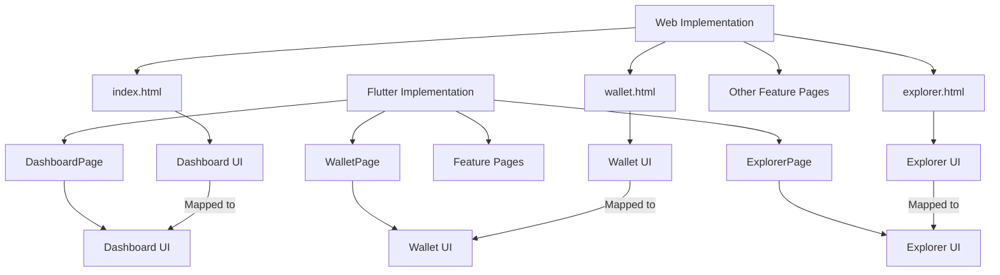

# GOFLUTTER UI Parallelization Design Document

## 1. Overview

This document outlines the design for aligning the GOFLUTTER Flutter application with the web frontend implementation. The goal is to ensure that the Flutter application mirrors the web interface in both structure and functionality, providing a consistent user experience across platforms while maintaining the native capabilities of Flutter.

## 2. Architecture

### 2.1 Current Structure
The GOFLUTTER application follows a feature-based architecture with the following key components:
- **Core**: Contains shared utilities, routing, API clients, and services
- **Features**: Modular organization by functionality (auth, wallet, explorer, governance, etc.)
- **Shared**: Common themes, widgets, and reusable components

### 2.2 Web Structure Analysis
The web frontend consists of individual HTML pages with embedded CSS and JavaScript:
- `index.html`: Main dashboard with navigation to all features
- `wallet.html`: Wallet management interface
- `explorer.html`: Blockchain explorer
- Feature-specific pages for governance, DeFi, identity, social, contracts, health, and node dashboard

### 2.3 Component Architecture Comparison



## 3. UI Component Mapping

### 3.1 Dashboard Page (index.html → dashboard_page.dart)

| Web Component | Flutter Equivalent | Status | Notes |
|---------------|-------------------|--------|-------|
| Header with title and description | `_buildHeader()` in DashboardPage | ✅ Complete | Uses ShaderMask for gradient text effect |
| Logout button | AppBar action in DashboardPage | ✅ Complete | Positioned in AppBar actions |
| Node selector | NodeSelector widget | ✅ Complete | Custom widget for node selection |
| Navigation grid | `_buildNavGrid()` with NavCard widgets | ✅ Complete | GridView with 9 NavCard widgets |
| Network architecture section | NetworkArchitectureCard widget | ✅ Complete | Displays network information |
| Refresh button | `_buildRefreshButton()` | ✅ Complete | Positioned as FloatingActionButton |

### 3.2 Wallet Page (wallet.html → wallet_page.dart)

| Web Component | Flutter Equivalent | Status | Notes |
|---------------|-------------------|--------|-------|
| Back button | AppScaffold back navigation | ✅ Complete | Handled by AppScaffold |
| Wallet overview panel | WalletOverviewPanel widget | ✅ Partial | Missing some features like faucet, validator registration |
| Transaction panel | SendTransactionPanel widget | ✅ Partial | Basic send transaction functionality |
| Account selection | Missing in Flutter | ❌ Missing | Need to implement account switching |
| Faucet section | Missing in Flutter | ❌ Missing | Need to add testnet faucet functionality |
| Validator registration | Missing in Flutter | ❌ Missing | Need to implement KYC fields and registration |
| Security information | Missing in Flutter | ❌ Missing | Need to add security info section |

### 3.3 Explorer Page (explorer.html → explorer_page.dart)

| Web Component | Flutter Equivalent | Status | Notes |
|---------------|-------------------|--------|-------|
| Back button | AppScaffold back navigation | ✅ Complete | Handled by AppScaffold |
| Search bar | ExplorerSearchBar widget | ✅ Complete | Custom search widget |
| Block list | `_buildBlocksView()` with BlockListItem | ✅ Complete | Displays blocks in ListView |
| Block details modal | Missing in Flutter | ❌ Missing | Need to implement block detail view |
| Transaction tab | `_buildTransactionsView()` | ⚠️ Partial | Placeholder implementation |

## 4. Detailed Implementation Plan

### 4.1 Wallet Feature Enhancements

#### Account Management
- **Current State**: Basic wallet functionality implemented
- **Missing Components**:
  - Account selection dropdown
  - Create new account functionality
  - Import/export account functionality
  - Delete account functionality

#### Faucet Integration
- **Current State**: Not implemented
- **Required Implementation**:
  - Add faucet section to WalletOverviewPanel
  - Implement faucet request functionality
  - Add UI elements for requesting test tokens

#### Validator Registration
- **Current State**: Not implemented
- **Required Implementation**:
  - Add validator registration section
  - Implement KYC fields (stake amount, full name, country, ID number, verification checkbox)
  - Add registration submission functionality

#### Security Information
- **Current State**: Not implemented
- **Required Implementation**:
  - Add security information section
  - Display wallet security details (private key storage, signing, etc.)

### 4.2 Explorer Feature Enhancements

#### Block Details View
- **Current State**: Blocks displayed in list but no detail view
- **Required Implementation**:
  - Add modal or separate page for block details
  - Display all block information (hash, previous hash, timestamp, validator, signature)
  - Show transaction details within block

#### Transaction Explorer
- **Current State**: Placeholder implementation
- **Required Implementation**:
  - Implement transaction fetching functionality
  - Display transactions in list format
  - Add transaction detail view

### 4.3 Additional Pages to Implement

#### Governance Page
- **Current State**: Basic page structure exists
- **Required Implementation**:
  - Add proposal creation functionality
  - Implement proposal detail view
  - Add voting mechanism

#### DeFi Page
- **Current State**: Basic page structure exists
- **Required Implementation**:
  - Add DeFi functionality (staking, liquidity pools, etc.)
  - Implement relevant UI components

#### Identity Page
- **Current State**: Basic page structure exists
- **Required Implementation**:
  - Add identity management features
  - Implement profile editing
  - Add KYC functionality

#### Social Page
- **Current State**: Basic page structure exists
- **Required Implementation**:
  - Add social features (posts, comments, likes)
  - Implement feed generation
  - Add real-time updates

#### Contracts Page
- **Current State**: Basic page structure exists
- **Required Implementation**:
  - Add smart contract deployment functionality
  - Implement contract interaction features
  - Add contract management UI

#### Health Page
- **Current State**: Basic page structure exists
- **Required Implementation**:
  - Add system health monitoring
  - Implement performance metrics display
  - Add testing functionality

#### Node Dashboard Page
- **Current State**: Basic page structure exists
- **Required Implementation**:
  - Add node status monitoring
  - Implement peer list display
  - Add validator performance metrics

## 5. Routing Alignment

### 5.1 Current Routing Structure
The GOFLUTTER application uses GoRouter for navigation with the following routes:
- `/` → IntroPage
- `/dashboard` → DashboardPage
- `/login` → LoginScreen
- `/register` → RegisterScreen
- `/wallet` → WalletPage
- `/explorer` → ExplorerPage
- Feature-specific routes for governance, DeFi, identity, social, contracts, health, node-dashboard

### 5.2 Web Navigation Structure
The web implementation uses direct HTML page navigation:
- `index.html` (main dashboard)
- `wallet.html`
- `explorer.html`
- Feature-specific HTML pages

### 5.3 Alignment Strategy
The current routing structure in GOFLUTTER already aligns well with the web navigation. No major changes needed to routing.

## 6. Styling and Visual Consistency

### 6.1 Current Styling Approach
GOFLUTTER uses a custom theme system with:
- AppColors for consistent color palette
- AppTextStyles for typography
- AppShadows for consistent shadows
- Custom widgets for reusable components

### 6.2 Web Styling Elements to Replicate
- Gradient backgrounds
- Glass morphism effects (backdrop-filter blur)
- Card-based layout with hover effects
- Consistent spacing and padding
- Responsive design for different screen sizes

### 6.3 Implementation Plan
- Enhance existing theme to match web color scheme
- Add glass morphism effects to cards and panels
- Implement hover effects where applicable
- Ensure responsive design matches web implementation

## 7. Data Flow and API Integration

### 7.1 Current Implementation
GOFLUTTER uses a layered architecture:
- Repository pattern for data access
- BLoC pattern for state management
- API clients for backend communication

### 7.2 Web Implementation
Web uses direct API calls with JavaScript:
- Fetch API for HTTP requests
- Local storage for client-side data persistence

### 7.3 Alignment Strategy
The current data flow in GOFLUTTER is more structured and maintainable than the web implementation. No changes needed to the data flow architecture.

## 8. Testing Strategy

### 8.1 Current Testing Approach
GOFLUTTER includes:
- Unit tests for core functionality
- Widget tests for UI components
- Integration tests for feature flows

### 8.2 Required Testing for New Features
- Unit tests for new wallet functionality
- Widget tests for new UI components
- Integration tests for end-to-end flows
- Responsive design testing across device sizes

## 9. Implementation Roadmap

### Phase 1: Wallet Enhancements (High Priority)
1. Implement account management features
2. Add faucet integration
3. Implement validator registration
4. Add security information section

### Phase 2: Explorer Enhancements (High Priority)
1. Implement block details view
2. Complete transaction explorer functionality

### Phase 3: Remaining Feature Pages (Medium Priority)
1. Enhance governance page
2. Implement DeFi functionality
3. Complete identity management
4. Add social features
5. Implement contracts functionality
6. Enhance health monitoring
7. Complete node dashboard

### Phase 4: Styling and Polish (Low Priority)
1. Enhance visual consistency with web
2. Add hover effects and animations
3. Implement responsive design improvements

## 10. Detailed Component Designs

### 10.1 Wallet Page Enhancement

#### Current Structure
```
WalletPage
├── WalletOverviewPanel
└── SendTransactionPanel
```

#### Proposed Enhanced Structure
```
WalletPage
├── WalletOverviewPanel
│   ├── AccountSelector
│   ├── BalanceDisplay
│   ├── AddressDisplay
│   ├── WalletActions
│   │   ├── CreateAccountButton
│   │   ├── ImportAccountButton
│   │   └── ExportAccountButton
│   ├── FaucetSection
│   │   ├── FaucetTitle
│   │   ├── FaucetDescription
│   │   └── RequestFaucetButton
│   ├── ValidatorRegistrationSection
│   │   ├── RegistrationTitle
│   │   ├── RegistrationDescription
│   │   ├── KYCFields
│   │   │   ├── StakeAmountInput
│   │   │   ├── FullNameInput
│   │   │   ├── CountryInput
│   │   │   ├── IDNumberInput
│   │   │   └── VerificationCheckbox
│   │   └── SubmitRegistrationButton
│   └── SecurityInfoSection
│       ├── SecurityTitle
│       └── SecurityDetails
└── SendTransactionPanel
    ├── RecipientAddressInput
    ├── AmountInput
    ├── MessageInput
    └── SendTransactionButton
```

### 10.2 Explorer Page Enhancement

#### Current Structure
```
ExplorerPage
├── ExplorerSearchBar
└── TabBarView
    ├── BlocksView
    └── TransactionsView (Placeholder)
```

#### Proposed Enhanced Structure
```
ExplorerPage
├── ExplorerSearchBar
└── TabBarView
    ├── BlocksView
    │   ├── BlockList
    │   │   └── BlockListItem (with tap handler)
    │   └── BlockDetailModal
    │       ├── BlockHeaderInfo
    │       ├── BlockDetails
    │       └── TransactionList
    │           └── TransactionItem
    └── TransactionsView
        ├── TransactionList
        │   └── TransactionListItem (with tap handler)
        └── TransactionDetailModal
            ├── TransactionDetails
            └── RelatedBlockInfo
```

## 11. API Integration Requirements

### 11.1 Wallet API Endpoints Needed
- `POST /faucet` - Request test tokens
- `POST /register-validator` - Register as validator
- `GET /accounts` - List accounts
- `POST /accounts` - Create new account
- `DELETE /accounts/{id}` - Delete account
- `POST /accounts/import` - Import account
- `GET /accounts/{id}/export` - Export account

### 11.2 Explorer API Endpoints Needed
- `GET /blocks/{hash}` - Get block details
- `GET /transactions/{hash}` - Get transaction details
- `GET /blocks` - List blocks
- `GET /transactions` - List transactions

## 12. State Management Enhancement

### 12.1 Current Wallet State
```dart
WalletState {
  Wallet? wallet;
  List<Account> accounts;
  bool isLoading;
  String? error;
}
```

### 12.2 Enhanced Wallet State
```dart
EnhancedWalletState {
  Wallet? wallet;
  List<Account> accounts;
  int selectedAccountIndex;
  bool isLoading;
  String? error;
  bool isFaucetLoading;
  String? faucetError;
  bool isRegistrationLoading;
  String? registrationError;
}
```

### 12.3 Current Explorer State
```dart
ExplorerState {
  List<Block> blocks;
  bool isLoading;
  String? error;
}
```

### 12.4 Enhanced Explorer State
```dart
EnhancedExplorerState {
  List<Block> blocks;
  List<Transaction> transactions;
  Block? selectedBlock;
  Transaction? selectedTransaction;
  bool isLoading;
  bool isBlockDetailLoading;
  bool isTransactionDetailLoading;
  String? error;
}
```

## 13. New UI Components to Implement

### 13.1 Wallet Components

#### AccountSelector Widget
- Dropdown or selector for switching between accounts
- Display account name and abbreviated address
- Add new account button

#### FaucetSection Widget
- Title and description of faucet functionality
- Request tokens button
- Loading state and success/error feedback

#### ValidatorRegistrationSection Widget
- Form for validator registration
- KYC input fields (stake amount, name, country, ID)
- Verification checkbox
- Submit button with loading state

#### SecurityInfoSection Widget
- Display wallet security information
- Information about private key storage
- Signing process details
- Warning about data loss

### 13.2 Explorer Components

#### BlockDetailModal Widget
- Modal dialog for displaying block details
- Block header information (hash, previous hash, timestamp)
- Validator information
- Transaction list within the block

#### TransactionDetailModal Widget
- Modal dialog for displaying transaction details
- Sender and recipient addresses
- Amount and fee information
- Timestamp and signature

### 13.3 Shared Components

#### GlassCard Widget
- Card with glass morphism effect
- Blur background
- Border with transparency
- Shadow effects

#### HoverEffectContainer Widget
- Container with hover effects
- Elevation change on hover
- Color transition effects

#### ResponsiveGrid Widget
- Grid that adapts to screen size
- Responsive column count
- Consistent spacing across devices

## 14. Styling Enhancements

### 14.1 Color Palette Alignment

| Web Color | Flutter Equivalent | Usage |
|-----------|-------------------|-------|
| `#f8fafc` to `#cbd5e0` gradient | AppColors.backgroundGradient | Main background |
| `#4299e1` | AppColors.primary | Primary actions |
| `#48bb78` | AppColors.success | Success states |
| `#ed8936` | AppColors.warning | Warning states |
| `#2d3748` to `#718096` gradient | AppColors.textGradient | Headers |

### 14.2 Typography Alignment

| Web Style | Flutter Equivalent | Usage |
|----------|-------------------|-------|
| Inter font family | AppTextStyles.fontFamily | All text |
| Font weights 400-800 | AppTextStyles weights | Various text elements |
| Font sizes 0.75rem to 3.5rem | AppTextStyles sizes | Headings and body text |

### 14.3 Spacing System

| Web Spacing | Flutter Equivalent | Usage |
|------------|-------------------|-------|
| 20px padding | AppSpacing.lg | Container padding |
| 15px gap | AppSpacing.md | Element spacing |
| 10px margin | AppSpacing.sm | Small spacing |
| 5px spacing | AppSpacing.xs | Minimal spacing |

## 15. Testing Requirements

### 15.1 Unit Tests

#### Wallet Functionality Tests
- Account creation and management
- Transaction sending
- Faucet request processing
- Validator registration submission

#### Explorer Functionality Tests
- Block data fetching and display
- Transaction data fetching and display
- Search functionality
- Detail view navigation

### 15.2 Widget Tests

#### New Component Tests
- AccountSelector widget behavior
- FaucetSection widget states
- ValidatorRegistrationSection form validation
- BlockDetailModal display
- TransactionDetailModal display

#### Existing Component Enhancement Tests
- WalletOverviewPanel with new sections
- ExplorerPage with detail views
- NavCard hover effects
- GlassCard visual effects

### 15.3 Integration Tests

#### End-to-End Flows
- Wallet setup and account creation
- Transaction sending flow
- Block exploration flow
- Validator registration flow

#### API Integration Tests
- Faucet request integration
- Validator registration API calls
- Block detail fetching
- Transaction detail fetching

### 15.4 UI/UX Tests

#### Responsive Design Tests
- Mobile viewport rendering
- Tablet viewport rendering
- Desktop viewport rendering
- Orientation change handling

#### Visual Consistency Tests
- Color palette matching
- Typography consistency
- Spacing adherence
- Hover effect implementation

## 16. Performance Considerations

### 16.1 UI Performance
- Efficient widget rebuilding
- Proper use of const constructors
- Lazy loading for large data sets
- Image optimization for icons

### 16.2 Memory Management
- Proper disposal of controllers
- Memory leak prevention in widgets
- Efficient state management
- Resource cleanup

### 16.3 Network Optimization
- API caching strategies
- Request batching
- Error handling and retries
- Offline capability considerations

## 17. Conclusion

The GOFLUTTER application has a solid foundation that aligns well with the web implementation in terms of structure and navigation. The main areas that need enhancement are:

1. **Wallet Functionality**: Adding account management, faucet integration, validator registration, and security information
2. **Explorer Features**: Implementing block and transaction detail views
3. **Remaining Pages**: Completing the UI for governance, DeFi, identity, social, contracts, health, and node dashboard
4. **Styling Consistency**: Enhancing visual elements to match the web design with glass morphism effects and hover animations

The implementation should follow the phased approach outlined in the roadmap, starting with the high-priority wallet and explorer enhancements. The existing architecture provides a strong base for these additions, with the BLoC pattern and repository structure supporting clean and maintainable code.

By following this design document, the GOFLUTTER application will achieve full parity with the web frontend while leveraging Flutter's native capabilities for an enhanced user experience.