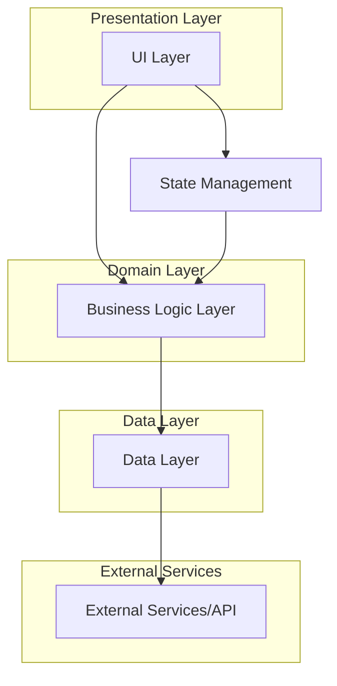

# Development Guide for Fixing GOFLUTTER Project Issues

## 1. Overview

This document provides a comprehensive guide to resolve compilation issues in the GOFLUTTER project and get it running properly. Based on the analysis of the codebase, the main issues stem from dependency resolution, import statements, and missing model definitions.

## 2. Repository Type

The GOFLUTTER project is a **Mobile Application** built with Flutter, implementing a blockchain wallet interface with features like governance, DeFi, social networking, and identity management.

## 3. Architecture

The project follows a clean architecture pattern with feature-first organization:



## 4. Component Architecture

### 4.1 Main Components

1. **Authentication System** - Handles user login/registration and secure storage
2. **Dashboard** - Main overview of blockchain status and user data
3. **Wallet** - Cryptocurrency wallet functionality
4. **Governance** - Proposal creation and voting system
5. **Explorer** - Blockchain data exploration
6. **DeFi** - Decentralized finance features
7. **Identity** - User identity management
8. **Social** - Social networking features
9. **Contracts** - Smart contract interaction
10. **Health** - Node and system health monitoring

### 4.2 State Management

The project uses:
- **Provider** for simple state management
- **BLoC** pattern for complex business logic
- **GoRouter** for navigation

## 5. Dependency Resolution Issues

### 5.1 Problem
The most common errors are "Not found" errors for packages like `convert`, `pointycastle`, `flutter_secure_storage`, `rxdart`, `equatable`, etc.

### 5.2 Solution

1. **Verify pubspec.yaml dependencies**:
   ```yaml
   dependencies:
     flutter:
       sdk: flutter
     # State Management
     flutter_bloc: ^8.1.3
     bloc: ^8.1.2
     provider: ^6.1.1
     equatable: ^2.0.5
     
     # HTTP & API
     http: ^1.1.0
     dio: ^5.3.2
     
     # Local Storage
     flutter_secure_storage: ^8.0.0
     shared_preferences: ^2.2.2
     
     # Crypto & Security
     crypto: ^3.0.3
     pointycastle: ^3.7.3
     convert: ^3.1.1
     web3dart: ^2.7.1
     
     # Reactive Programming
     rxdart: ^0.27.7
     
     # Navigation
     go_router: ^10.1.2
   ```

2. **Clean and reinstall dependencies**:
   ```bash
   flutter pub cache repair
   flutter clean
   flutter pub get
   ```

3. **Check for conflicting versions**:
   ```bash
   flutter pub outdated
   flutter pub upgrade
   ```

## 6. Missing Imports and Type Errors

### 6.1 Problem
Errors like "Type 'GoRouter' not found", "Type 'Dio' isn't a type", "Undefined name 'ApiClient'"

### 6.2 Solution

1. **Check import statements**:
   - Ensure all imports use correct package names
   - Verify relative imports use correct paths
   - Add missing imports for required packages

2. **Fix ApiClient reference**:
   ```dart
   // Instead of:
   final Dio _dio = ApiClient.instance;
   
   // Use:
   import 'package:dio/dio.dart';
   final Dio _dio = Dio();
   ```

3. **Fix repository implementations**:
   ```dart
   // Ensure all domain entities are properly imported:
   import '../../domain/entities/user_identity.dart';
   import '../../domain/entities/post.dart';
   import '../../domain/entities/contract.dart';
   import '../../domain/entities/health_status.dart';
   ```

## 7. BLoC Implementation Issues

### 7.1 Problem
Errors like "The method 'on' isn't defined", "Emitter isn't a type", "Too many positional arguments"

### 7.2 Solution

1. **Update BLoC base class**:
   ```dart
   import 'package:bloc/bloc.dart';
   import 'package:equatable/equatable.dart';
   
   class DashboardBloc extends Bloc<DashboardEvent, DashboardState> {
     DashboardBloc() : super(DashboardInitial()) {
       on<LoadDashboardData>(_onLoadDashboardData);
       on<RefreshDashboardData>(_onRefreshDashboardData);
     }
   }
   ```

2. **Fix event handlers**:
   ```dart
   Future<void> _onLoadDashboardData(
     LoadDashboardData event,
     Emitter<DashboardState> emit,
   ) async {
     emit(DashboardLoading());
     try {
       // Load data
       emit(DashboardLoaded(data: data));
     } catch (e) {
       emit(DashboardError(message: e.toString()));
     }
   }
   ```

## 8. GoRouter Navigation Issues

### 8.1 Problem
"Method 'go' isn't defined for the class 'BuildContext'"

### 8.2 Solution

1. **Ensure proper GoRouter setup**:
   ```dart
   import 'package:go_router/go_router.dart';
   
   final GoRouter appRouter = GoRouter(
     routes: [
       GoRoute(
         path: '/',
         builder: (context, state) => const HomeScreen(),
       ),
       // Add other routes
     ],
   );
   ```

2. **Use context.go() correctly**:
   ```dart
   // In widgets, use:
   context.go('/dashboard');
   
   // Instead of:
   Navigator.push(...) // for traditional navigation
   ```

## 9. Missing Model Definitions

### 9.1 Problem
References to undefined classes like `UserIdentity`, `Post`, `Contract`, `HealthStatus`

### 9.2 Solution

Based on the analysis, all required model files are already present in the project:
- `lib/features/identity/domain/entities/user_identity.dart`
- `lib/features/social/domain/entities/post.dart`
- `lib/features/contracts/domain/entities/contract.dart`
- `lib/features/health/domain/entities/health_status.dart`

Ensure these files are properly imported where needed.

## 10. Development Workflow

### 10.1 Step-by-step approach:

1. **Start with core dependencies**:
   - Fix pubspec.yaml
   - Run `flutter pub get`
   - Resolve basic import errors

2. **Fix model and entity definitions**:
   - Create missing model files (if any)
   - Implement basic JSON serialization

3. **Fix repository implementations**:
   - Update API client usage
   - Fix data mapping

4. **Fix BLoC implementations**:
   - Update base classes
   - Fix event handlers

5. **Fix UI components**:
   - Update navigation
   - Fix widget references

6. **Test incrementally**:
   - Run the app frequently
   - Fix errors as they appear

## 11. Testing Strategy

### 11.1 Unit Testing
```bash
flutter test test/unit/
```

### 11.2 Widget Testing
```bash
flutter test test/widget/
```

### 11.3 Integration Testing
```bash
flutter test test/integration/
```

## 12. Common Debugging Commands

```bash
# Clean build
flutter clean

# Get dependencies
flutter pub get

# Check for outdated packages
flutter pub outdated

# Upgrade packages
flutter pub upgrade

# Analyze code
flutter analyze

# Run tests
flutter test
```

## 13. Backend Integration

Ensure the ATLAS.BC backend is running:
1. Navigate to `ATLAS.BC0.0.1` directory
2. Run the blockchain node:
   ```bash
   go run cmd/main.go
   ```
3. Verify API endpoints are accessible at `http://localhost:8080`

## 14. Expected Issues and Solutions

### 14.1 Platform-Specific Issues
Some packages like `flutter_secure_storage` may require platform-specific setup:
- Android: May need permissions in AndroidManifest.xml
- iOS: May need specific configuration in Info.plist

### 14.2 Network Security (Android 9+)
For Android 9+ (API level 28+), add network security config to allow HTTP traffic to localhost:
```xml
<!-- android/app/src/main/res/xml/network_security_config.xml -->
<?xml version="1.0" encoding="utf-8"?>
<network-security-config>
    <domain-config cleartextTrafficPermitted="true">
        <domain includeSubdomains="true">localhost</domain>
        <domain includeSubdomains="true">10.0.2.2</domain>
    </domain-config>
</network-security-config>
```

And reference it in AndroidManifest.xml:
```xml
<application
    android:networkSecurityConfig="@xml/network_security_config"
    ...>
</application>
```

## 15. Implementation Steps

### Step 1: Dependency Resolution
1. Run `flutter pub get` to install all dependencies
2. If there are version conflicts, run `flutter pub upgrade`

### Step 2: Fix Import Issues
1. Check all import statements for correctness
2. Ensure relative paths are accurate
3. Add missing imports for domain entities

### Step 3: Verify Model Definitions
1. Confirm all model files exist in the correct locations
2. Check that all required fields are properly defined
3. Verify JSON serialization methods

### Step 4: Fix Repository Implementations
1. Update API client usage to match current Dio version
2. Ensure proper error handling
3. Fix data mapping between API responses and domain entities

### Step 5: Fix BLoC Implementations
1. Update all BLoC classes to use the correct syntax
2. Ensure event handlers are properly defined
3. Fix state transitions

### Step 6: Fix UI Components
1. Update navigation to use GoRouter correctly
2. Fix any widget references that may be broken
3. Ensure proper state management integration

### Step 7: Test and Debug
1. Run the app and fix any remaining issues
2. Test all major features
3. Run the test suite to ensure nothing is broken

This systematic approach should resolve the compilation issues and get the GOFLUTTER project running properly.