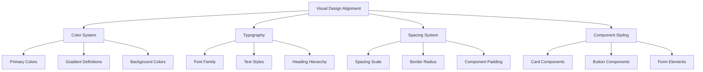
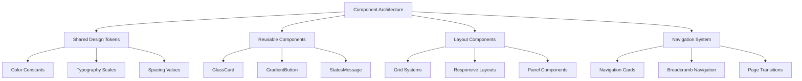

# Flutter UI Alignment Design Document

## 1. Overview

This document outlines the plan to align the Flutter UI (GOFLUTTER) with the web frontend (ATLAS.BC0.0.1/web/frontend) to make them visually indistinguishable. The goal is to ensure both implementations share the same visual design language, components, and user experience while maintaining their respective technical implementations.

## 2. Current State Analysis

### 2.1 Web Frontend Characteristics

The web frontend features:
- **Design Language**: Glass morphism with gradient backgrounds and subtle shadows
- **Color Palette**: Blue-based primary colors with gradient accents
- **Typography**: Inter font family with specific sizing and weights
- **Layout**: Responsive grid system with card-based components
- **Visual Effects**: Backdrop blur, hover animations, and gradient overlays
- **Navigation**: Card-based navigation system with hover effects

### 2.2 Flutter Implementation Characteristics

The Flutter implementation currently features:
- **Design Language**: Material Design with custom theming
- **Color Palette**: Similar blue-based scheme but with different implementation
- **Typography**: Custom text styles matching web specifications
- **Components**: GlassCard, GradientButton, and other custom widgets
- **Navigation**: Bottom navigation bar with standard Material Design

## 3. UI Alignment Strategy

### 3.1 Visual Design Alignment



### 3.2 Component Architecture Alignment



## 4. Detailed Alignment Plan

### 4.1 Color System Alignment

| Web Property | Current Flutter | Target Flutter | Action Required |
|--------------|----------------|----------------|-----------------|
| Primary Gradient | `linear-gradient(135deg, #4299e1, #3182ce)` | `AppColors.primaryGradient` | Verify match |
| Background Gradient | `linear-gradient(135deg, #f8fafc 0%, #e2e8f0 50%, #cbd5e0 100%)` | `AppColors.backgroundGradient` | Update stops |
| Card Background | `rgba(255, 255, 255, 0.95)` | `AppColors.surfaceOpaque` | Verify opacity |
| Wallet Gradient | `linear-gradient(135deg, #11998e, #0d7a6f)` | `AppColors.walletGradient` | Verify match |

### 4.2 Typography Alignment

| Element | Web Style | Flutter Style | Action Required |
|---------|-----------|---------------|-----------------|
| Headings | Inter font, specific weights | `AppTextStyles` | Verify font family |
| Body Text | Inter font, 16px base | `AppTextStyles.body1` | Match sizing |
| Captions | Inter font, 12px | `AppTextStyles.caption` | Match sizing |

### 4.3 Component Alignment

#### 4.3.1 Glass Card Component
**Web Implementation:**
- Backdrop blur effect (20px)
- Border radius: 20px
- Box shadow with multiple layers
- Border: 1px solid rgba(255,255,255,0.2)
- Background: rgba(255, 255, 255, 0.95)

**Flutter Implementation:**
- Current: `GlassCard` widget with similar properties
- Action: Verify visual match and adjust parameters if needed

#### 4.3.2 Gradient Button Component
**Web Implementation:**
- Gradient background
- Hover effects with scale transform
- Box shadow on hover
- Padding: 8px 16px (small) to 12px 20px (large)

**Flutter Implementation:**
- Current: `GradientButton` widget
- Action: Ensure hover effects and sizing match

#### 4.3.3 Navigation System
**Web Implementation:**
- Card-based navigation with 4-column grid
- Each card has icon, title, and description
- Hover effects with elevation and scale
- Gradient buttons for actions

**Flutter Implementation:**
- Current: Bottom navigation bar
- Target: Card-based navigation similar to web
- Action: Replace bottom navigation with card grid

## 5. Page-by-Page Alignment Plan

### 5.1 Landing/Intro Page
**Web Features:**
- Large header with gradient text
- Feature carousel with navigation dots
- Launch button with gradient background
- Responsive layout for mobile

**Flutter Alignment:**
- Replace current `IntroPage` with web-like design
- Implement carousel widget
- Use same color scheme and typography
- Add launch button with gradient

### 5.2 Dashboard Page
**Web Features:**
- Grid-based navigation cards
- Node status display
- Network architecture information
- Responsive layout

**Flutter Alignment:**
- Replace current dashboard with card grid
- Implement node status component
- Add network architecture section
- Ensure responsive behavior

### 5.3 Wallet Page
**Web Features:**
- Two-panel layout (wallet info and transaction)
- Wallet balance display with gradient background
- Account management section
- Transaction history list
- Faucet and validator registration sections

**Flutter Alignment:**
- Ensure two-panel layout matches
- Align wallet info styling
- Match account management UI
- Align transaction history display
- Add faucet and validator sections

## 6. Implementation Roadmap

### Phase 1: Foundation Alignment (Week 1)
- [ ] Align color system and gradients
- [ ] Align typography and text styles
- [ ] Align spacing and border radius system
- [ ] Update GlassCard component for visual match
- [ ] Update GradientButton component for visual match

### Phase 2: Component Architecture (Week 2)
- [ ] Implement card-based navigation system
- [ ] Create responsive grid components
- [ ] Align form elements styling
- [ ] Implement status message components
- [ ] Create reusable panel components

### Phase 3: Page Implementation (Week 3-4)
- [ ] Redesign Intro/Landing page
- [ ] Redesign Dashboard page
- [ ] Align Wallet page implementation
- [ ] Implement all missing sections
- [ ] Ensure cross-page consistency

### Phase 4: Testing and Refinement (Week 5)
- [ ] Cross-browser/device testing
- [ ] User experience validation
- [ ] Performance optimization
- [ ] Final visual adjustments

## 7. Technical Considerations

### 7.1 Responsive Design
- Implement responsive breakpoints matching web
- Ensure proper layout on mobile, tablet, and desktop
- Test with various screen sizes

### 7.2 Performance
- Optimize backdrop blur effects
- Minimize widget rebuilds
- Use efficient animation patterns

### 7.3 Maintainability
- Centralize design tokens
- Create reusable component library
- Document component usage

## 8. Success Criteria

1. **Visual Parity**: Users cannot distinguish between web and Flutter versions
2. **Consistent Experience**: All interactions feel the same across platforms
3. **Performance**: Smooth animations and transitions
4. **Responsiveness**: Proper layout on all device sizes
5. **Maintainability**: Easy to update and extend design system

## 9. Component Implementation Details

### 9.1 Glass Card Component
To match the web implementation exactly, the GlassCard widget should implement:
- Backdrop blur effect with sigmaX: 20, sigmaY: 20
- Border radius of 20px
- Dual shadow layers with specific opacities
- 1px solid border with 0.2 opacity white
- Background color with 0.95 opacity white

### 9.2 Gradient Button Component
The GradientButton should replicate:
- Primary gradient matching web: #4299e1 to #3182ce
- Hover effects with scale transformation
- Shadow effects on hover
- Consistent padding and text styling

### 9.3 Navigation System
Replace the bottom navigation with:
- Grid-based card layout (responsive columns)
- Each card containing icon, title, description
- Consistent styling with web navigation cards
- Hover effects and click handlers

## 10. Specific Flutter Implementation Examples

### 10.1 Updated GlassCard Widget
```dart
GlassCard({
  Key? key,
  required this.child,
  this.margin,
  this.width,
  this.height,
}) : super(key: key);

@override
Widget build(BuildContext context) {
  return Container(
    width: width,
    height: height,
    margin: margin ?? const EdgeInsets.all(20.0),
    decoration: BoxDecoration(
      color: Color(0xF2FFFFFF), // 0.95 opacity
      borderRadius: BorderRadius.circular(20.0),
      boxShadow: [
        BoxShadow(
          color: Colors.black.withOpacity(0.08),
          offset: const Offset(0, 20),
          blurRadius: 40,
          spreadRadius: 0,
        ),
        BoxShadow(
          color: Colors.black.withOpacity(0.06),
          offset: const Offset(0, 8),
          blurRadius: 16,
          spreadRadius: 0,
        ),
      ],
      border: Border.all(
        color: Colors.white.withOpacity(0.2), 
        width: 1,
      ),
    ),
    child: ClipRRect(
      borderRadius: BorderRadius.circular(20.0),
      child: BackdropFilter(
        filter: ImageFilter.blur(sigmaX: 20, sigmaY: 20),
        child: child,
      ),
    ),
  );
}
```

### 10.2 Updated AppScaffold Navigation
Replace the BottomAppBar with a responsive grid:
```dart
// In AppScaffold widget
body: Column(
  children: [
    Expanded(child: child),
    Container(
      padding: const EdgeInsets.all(20.0),
      child: LayoutBuilder(
        builder: (context, constraints) {
          int crossAxisCount = 4;
          if (constraints.maxWidth < 600) {
            crossAxisCount = 2;
          } else if (constraints.maxWidth < 1000) {
            crossAxisCount = 3;
          }
          
          return GridView.count(
            crossAxisCount: crossAxisCount,
            crossAxisSpacing: 20,
            mainAxisSpacing: 20,
            shrinkWrap: true,
            children: [
              NavigationCard(
                icon: '🔍',
                title: 'Explorer',
                description: 'Browse blocks, transactions, and network activity',
                onTap: () => context.go('/explorer'),
              ),
              NavigationCard(
                icon: '💼',
                title: 'Wallet',
                description: 'Manage accounts, balances, and transactions',
                onTap: () => context.go('/wallet'),
              ),
              // Add more navigation cards as needed
            ],
          );
        },
      ),
    ),
  ],
),
```